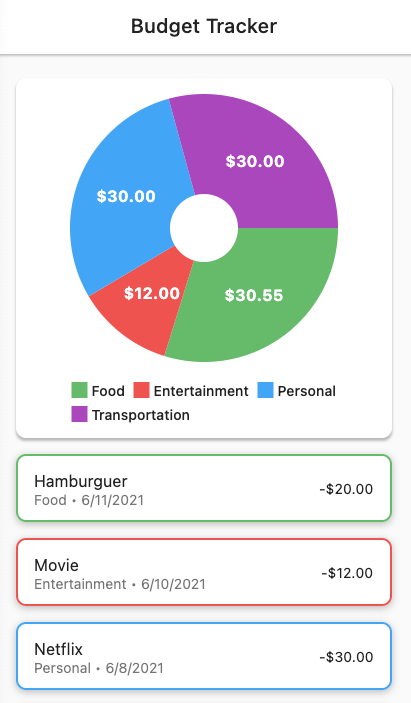

<!-- header section -->

  
   
  <b>Budget Tracker 💸📊</b> 

<!-- header section END -->

 

<!-- show case/gif section -->

<!-- show case/gif section END -->

<!-- about app and course section -->

## About this App 🗣

This app shows a list of budgets that are registered in a table in my Notion.
 
Yes, Notion now has an open API, for more information click [here](https://www.notion.so/) or [here](https://developers.notion.com).
 

## Tech Stack 👩🏾‍💻

- [Dart](https://dart.dev/)
- [Flutter](https://flutter.dev/)

## Plugins 📟

- [fl_chart](https://pub.dev/packages/dio)
- [http](https://pub.dev/packages/equatable)
- [intl](https://pub.dev/packages/flutter_bloc)
- [flutter_dotenv](https://pub.dev/packages/mask_text_input_formatter)

## Tools 🛠

- [hover](https://github.com/go-flutter-desktop/hover)

## About me

<!-- ALL-CONTRIBUTORS-LIST:START - Do not remove or modify this section -->
<!-- prettier-ignore -->
<table>
  <tr>
    <td align="center"><a href="https://twitter.com/samuelematias"> <b>Samuel Matias</b></a> <a href="https://github.com/samuelematias"title="Code">💻</a><a href="https://github.com/samuelematias"title="Design"> 🎨</a></td></td>
</table>

<!-- ALL-CONTRIBUTORS-LIST:END -->

<!-- about app and course section END -->
